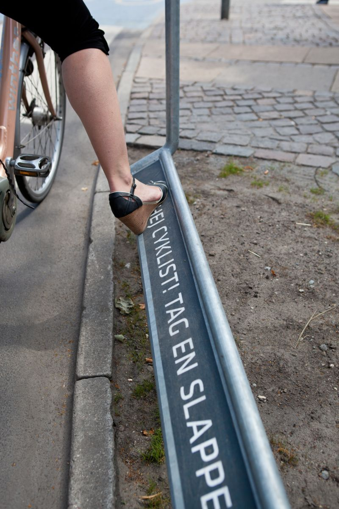

# Ciudades qué inspiran

>### Muchas grandes urbes se han adaptado con éxito a la movilidad individual y sin dudas deben ser ejemplos en los que inspirarse. Ciudades cómo: Ámsterdam, Copenhague, Barcelona, Bogotá, New York, Curitiva, Montreal entre otras.

(Amsterdam, Países Bajos)

(Copenhague, Dinamarca)

(Amsterdam, Países Bajos: Bicycle Parking)

(Barcelona, España)

(Cevilla, España)

(Rio de Janiero, Brasil)

(Montreal, Quebec, Canada)
