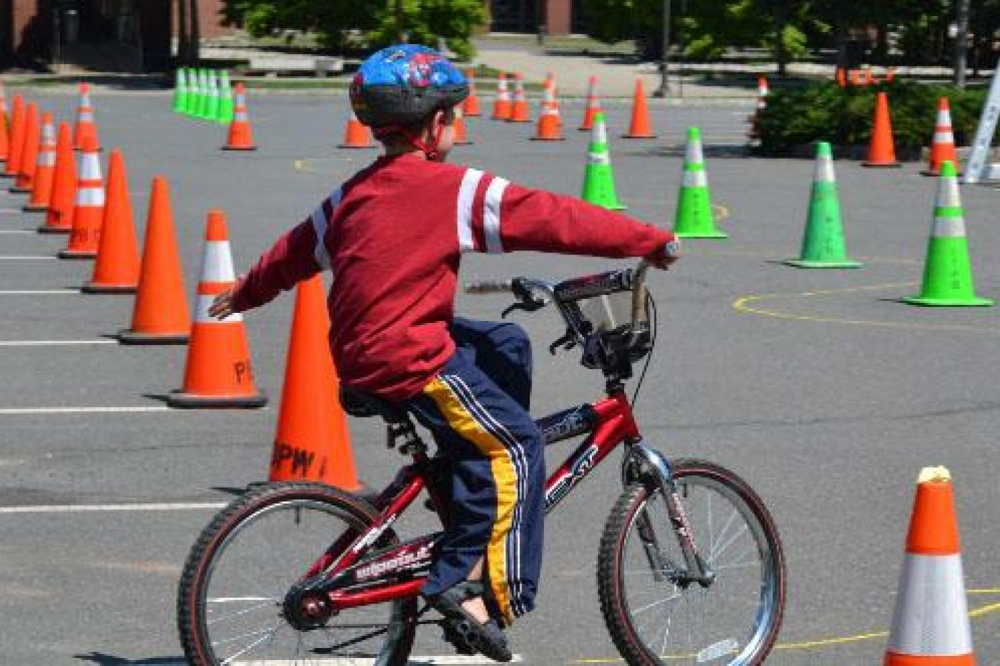

# ¡ Las buenas costumbres se educan ! 

>### Para lograr cambios genuinos y de largo plazo es necesario trabajar junto a la educación escolar primaria y secundaria. 

## Adaptación de espacios educativos y exparcimiento. 

#### Objetivos:
- Fomentar la cultura de la movilidad sostenible desde pequeños. 
- Generar las condiciones necesarias para la utilización de dicha movilidad. 
- Generar cambios culturales a largo plazo. 

#### Propuestas:
- Adaptar las escuelas públicas y privadas con espacios de estacionamiento para pequeños vehículos. 
- Asegurar dichos espacios con control policial y vigilancia electrónica. 
- Proveer a las escuelas de bicicletas de estrenamiendo para que los más pequeños desarrollen el equilibrio y motricidad fina. 

### [| Volver atrás |](../index.md)
