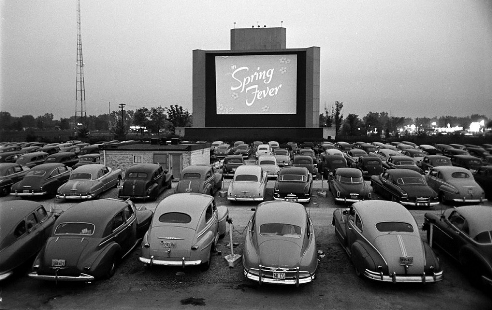

# El origen del problema

>### *El problema de movilidad en la mayoría de las ciudades es de origen fundacional.*

Por regla general, las ciudades evolucionan al ritmo de su crecimiento demográfico, sin demasiado planeamiento a futuro y atendiendo sólo las necesidades más inmediatas.

Esto hace qué regularmente, sea necesario realizar grandes inversiones en infraestructura y/o servicios, que colapsan e interrumpen por meses o años las áreas críticas o sensibles para el el normal desenvolvimiento, afectando la calidad de vida de sus habitantes, todo en pos de poder alojar más y más automóviles.

>### Muchas de las inversiones que realizan las ciudades no están destinadas a solucionar la raíz de los problemas sino que sólo aspiran a disminuir su impacto.

(Auto Cine de los años '50)

>### Los problemas de movilidad provienen de importar la cultura automotriz de los Estados Unidos de posguerra, en ciudades diseñadas a espejo de las principales capitales Europeas.

Al finalizar la segunda guerra mundial, Estados Unidos centró su recuperación económica y social en el automóvil, lo cual era coherente ya que disponía de una gigantesca industria metal-mecánica (utilizada para la fabricación de aviones, barcos y tanques durante la guerra) totalmente disponible, además de ciudades espaciosas de diseño moderno, amplias calles y totalmente horizontales.

Ejemplo de ello, fue la popularidad en el país, de servicios cómo el de comida rápida, lavaderos de autos, cines y muchos otros en los cuáles no era necesario que los ocupantes bajasen del vehículo.

>### Era común que en cada hogar americano haya uno o más vehículos.  

### Ciudad de Roma

Los problemas surgieron cuando aquel estilo de vida basado en el auto fue trasladada a ciudades de diseño europeo (Greco-Romanos) de aceras angostas, calzada pensadas para carruajes, y edificios de 2 o más plantas, qué en su mayoría, ni siquiera disponían de garajes o zonas de aparcamiento.

El diagrama de estas ciudades, construidas en base al peatón y vehículos de tracción de sangre, jamás lograron adaptarse al incremento exponencial del parque automotriz que sufrirían.
Sin entender el origen del problema, los urbanistas le asignaron más y más espacio y protagonismo al automóvil, empeorando la movilidad y  con ello, la calidad de vida de sus habitantes.

Si analizamos el diseño de la mayoría de las ciudades de hoy en día, es facil apreciar cómo se privilegia al automóvil sobre las personas en la vía pública.

>### Por suerte ésto puede re encausarse con pequeños y simples cambios, que apunten a devolver el protagonismo a las personas y mejoren su calidad de vida.
