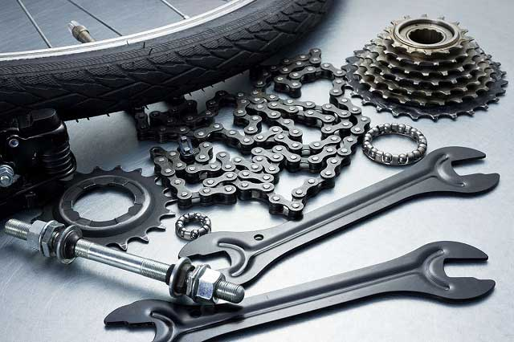

# ¡ Arreglar antes qué comprar ! 

>### En muchos hogares hay una bicicleta abandonada, y en otros hay más de una. Allí, en ese rincón juntando tierra, hay muchisimo potencial abandonado. 

## Micro créditos destinados a la reparación o el reciclado

##### Objetivos:
- Qué más personas recuperen la sana costumbre de pedalear. 
- Poner en circulaciónvvehículos abandonados o en mal estado. 
- Fomentar la economía de barrio, generando trabajo en pequeños talleres de pintura y reparación y gomerías. 

##### Propuestas:
- Créditos y planes sin interés para la compra de repuestos.
- Planes de fomento a pequeños talleres de pintura y reparación.
- Centros de reciclaje de bicicletas las que podrían ser reparadas y otrogadas a quienes las necesites, o utilizadas en una red de transporte público gratuito.

## Centros: "Hágalo usted mismo" 

##### Objetivos:
- Crear vínculos entre las personas y sus vehículos. 
- Crear vínculos con otras personas del barrio. 
- Qué niños y padres pasen tiempo de calidad entre ellos. 
- Poner a disposición profesionales ayuden en la realización y faciliten las herramientas necesarias. 
- Poner a disposicióneespacios municipales (por ejemplo escuelas y/o clubes) en los que las personas puedan acercarse con sus bicicletas y otros vehículos pequeños, y aprendan a repararlas ellas mismas.
- Generar ferias de intercambio de partes.
  
## Capacitación y fomento a pequeños talleres:

##### Objetivos:
- Ayudaree incentivar a pequeños talleres de reparación que son una pieza estratégica en la sostenibilidad del proyecto a largo.

##### Propuestas:
- Créditos destinados a la recuperación y mejora de pequeños talleres y gomerías de barrio. 
- Centros de capacitación y coordinación de profesionales del rubro.
- Cursos de reparación y montaje de pequeños vehículos.

> Los beneficiados de estos créditos podria ser los responsables en los centros Hágalo usted mismo.

### [| Volver atrás |](../index.md)
