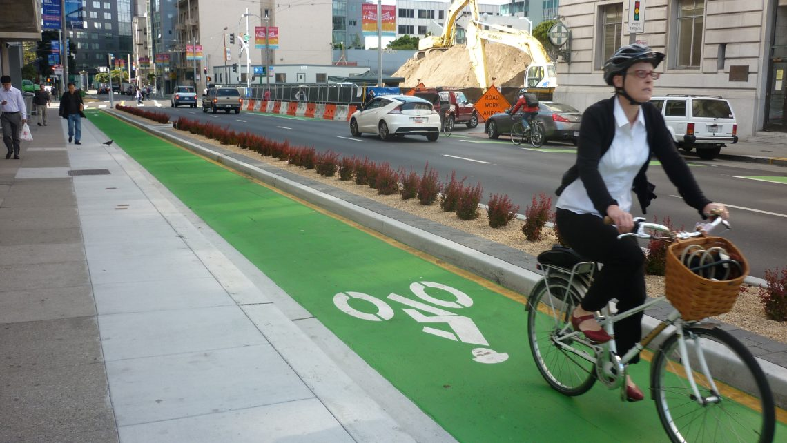

# Ciclo vías sí, pero...

(San Francisco, Polk Street)

> ### Las ciclo vías son un parte esencial de la infraestructura dedicada a la **movilidad individual**, y generalmente, es por donde muchos municipios deciden comenzar. Disponer de ciclo vías es importante, pero por sí solas no generan mejoras sustanciales. Antes de diagramar o construir una red de ciclo vías, es necesario planear y construir otro tipo de infraestructura que las sustente.

## Las ciclo vías son la frutillas del postre

Las ciclo vías son cómo las autopistas de sistemas de movilidad individual. Pero...

- ¿ De qué sirve una autopista que no conduce a donde quiero ir ?

- ¿ Donde estaciono mi vehículo una vez que llegue a mi destino ?

- ¿ Qué me garantíza seguridad en el transporte y aparcamiento ?

- ¿ Cómo lídio con el tránsito de mayor porte en lugares de alta concentración ?

> ### Antes de pensar en construir ciclo vías, es aconsejable tener respuesta a esas preguntas.

Sobran ejemplos de ciclo vías abandonadas, mal mantenidas, o qué son muy poco utilizadas.

Muchas veces la mala implementación de ellas se vuelve en contra de su propósito inicial, sentando un precedente negativo, haciendo que frentistas, automovilistas, y el transporte público, observe cómo su movilidad se ve afectada para qué muy pocos usuarios utilicen el sistema. Esto puede perjudicar la implementación de otras acciones a futuro.

<!-- Botón para volver al home -->

### [| Volver atrás |](https://galiprandi.github.io/ciudades-sostenibles/)
