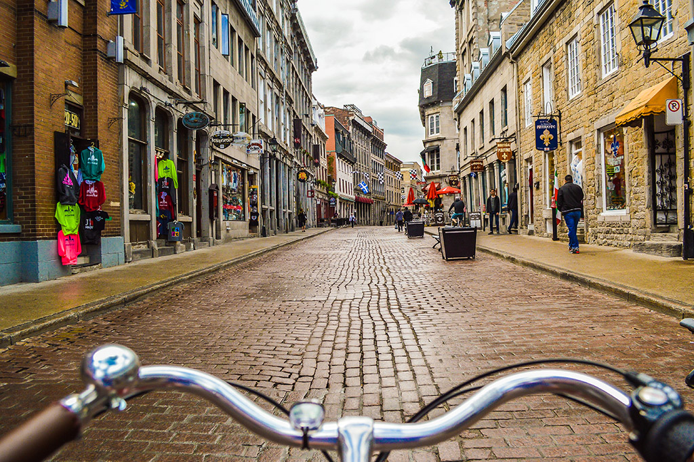

# Ciudades qué inspiran

> ### Muchas grandes urbes se han adaptado con éxito a la movilidad individual y sin dudas deben ser ejemplos en los que inspirarse. Ciudades cómo: Ámsterdam, Copenhague, Barcelona, Bogotá, New York, Curitiva, Montreal entre otras.

<!-- FLORAL ZU - "Una mirada artística sobre la bicicleta" - Congreso Mundial de la Bicicleta 2020 -->
<figure class="video_container">
  <iframe src="https://www.youtube.com/embed/oSSrOkgpOjY" frameborder="0" allowfullscreen="true" width="800" height="600"> </iframe>
  <figcaption>FLORAL ZU - "Una mirada artística sobre la bicicleta" - Congreso Mundial de la Bicicleta 2020</figcaption>
</figure>

<!-- Estación pública de reparación de bicicletas -->
<figure class="video_container">
  <iframe src="https://www.youtube.com/embed/Of-pggbr-DI" frameborder="0" allowfullscreen="true" width="800" height="600"> </iframe>
  <figcaption>Estación pública de reparación de bicicletas</figcaption>
</figure>

<!-- Video: Copenhague, ciudad de bicicletas -->
<figure class="video_container">
  <iframe src="https://www.youtube.com/embed/HUbrLNHLfEU" frameborder="0" allowfullscreen="true" width="800" height="600"> </iframe>
  <figcaption>Copenhague, ciudad de bicicletas</figcaption>
</figure>

(Miramar, Argentina)

(Amsterdam, Países Bajos)

(Copenhague, Dinamarca)

(Amsterdam, Países Bajos: Bicycle Parking)

(Barcelona, España)

(Cevilla, España)

(Rio de Janiero, Brasil)

(Montreal, Quebec, Canada)

(San Francisco, USA)

### [| Volver atrás |](https://galiprandi.github.io/ciudades-sostenibles/)
